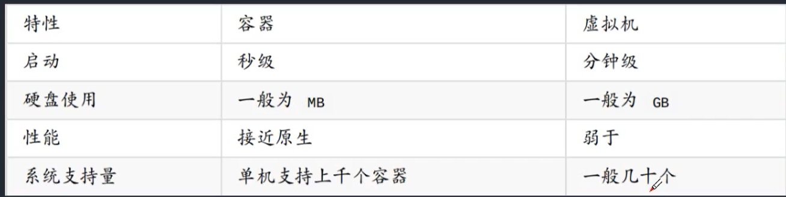
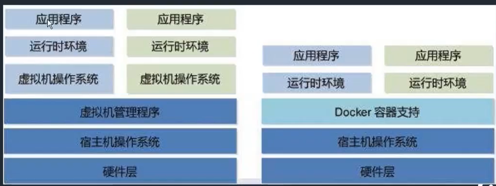
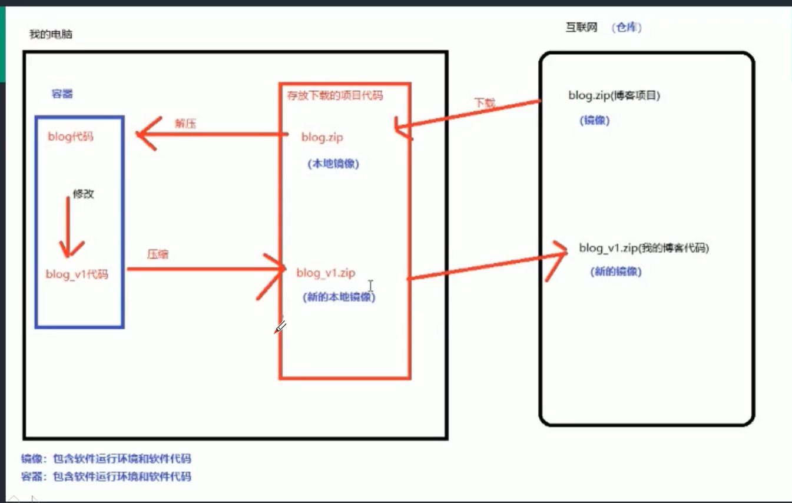
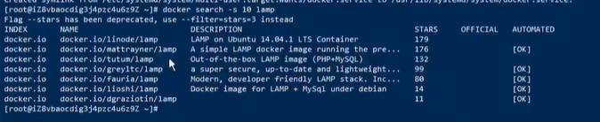
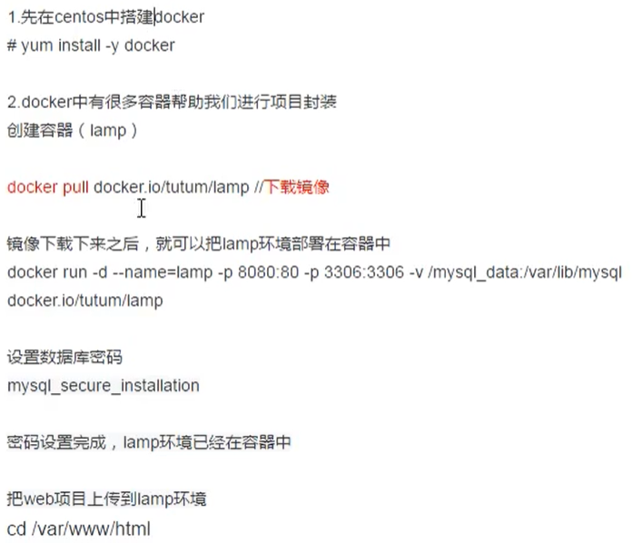
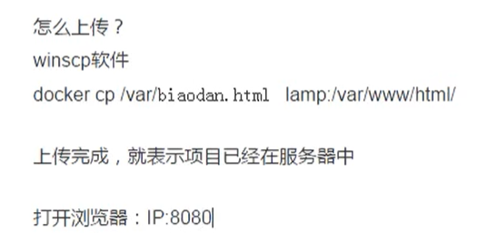

# Docker

#### 简介

- Docker最初是dotCloud公司创始人Solomon Hykes在法国期间发起的一个公司内部项目，它是基于dotCloud公司多年云服务技术的一次革新，并于2013年3月以Apache 2.0授权协议开源，主要项目代码在GitHub.上进行维护。
- Docker使用Google公司推出的Go语言进行开发实现，基于Linux内核的cgroup，namespace，以及AUFS类的Union FS等技术，对进程进行封装隔离，属于操作系统层面的虚拟化技术。由于隔离的进程独立于宿主和其它的隔离的进程，因此也称其为容器。

- Docker是一个开源的容器框架，基于Go语言实现,基于操作系统的虚拟化技术（有点类似于虚拟机）
- Docker可以打包应用程序和开发环境放在容器里面,这个容器可以放在任何Docker环境里面。
- 在鲸鱼上面的集装箱是沙盒机制,每个集装箱容器,不存在衽何关联
- Docker是一个平台 ,平台上面有很多容器，容器里面有很多项目(应用程序和他所需的环境)
- Docker的想法是创建软件程序可移植的轻量级容器,让其可以在安装Docker任何机器上能够运行，并不关系底层的操作系统(只要你操作系统中安装了docker ,都可以把这个集装箱给放上去) ，就像野心勃勃的造船者们创造了集装箱,而不需要考虑放在哪种船只上一样。
- 目标:简化部署流程,提供生产效率,使工作变得更加简单。
- 

#### Docker解决了什么

- 能解决虚拟机能够解决所有的问题,而且可能因为你硬件设备环境导致虚拟机没办法解决的事情

#### Docker与虚拟机的异同点

- 相同之处都是基于硬件平台,放在自己的操作系统中
- 不同之处:虚拟机需要借助于第三方软件,比如说VM ,在VM里面再装各种需要的操作系统，这时候需要的硬件资源会更多一些,比如说一个win系统需要40G内存, centos需要20G内存；然后再系统中再来进行环境搭建,比如说java项目的环境, php运行的环境, .net运行环境等,需要消耗资源过大。太笨重。
- Docker的话,它作为一个游轮(平台) ,上面有不同的集装箱，就可以把各自的项目环境和程序都放在集装箱中，各自封装。

#### Docker项目架构图解

##### Docker安装步骤

1. 更新云端环境：

- yum update -y

2.安装Docker

- yum install -y docker
- 查看Docker是否安装成功可以用docker version的方式来进行检查

3.启动docker

- systemctl start docker #启动docker
- systemctl enable docker   //添加如开机自启动

4.搭建LAMP的方式

- 找一个镜像直接包含全部

- apache、mysql、php独立连接

  - （1）最简单的方案：docker search -s IO lamp

  - 

  - （2）docker pull docker.io/tutum/lamp    //下载镜像文件

  - （3）docker images    //查看镜像

  - （4）创建LAMP容器： mkdir /mysql_data

  - （5）docker run -d --name=lamp -p 8080:80 -p 3306:3306 -v /mysql_data:/var/lib/mysql/docker.io/tutum/lamp

  - ps：将宿主机的目录/musal _data'映射到容器的*/var/lib/wysql’目示.这是因为默认情况下效据幸的效据库文件和日志文件都会存放于容器的AUFS文件层，这不仅不使得容器变得越来越臃肿。不便于迁移、备份等管理，而且数据库的性能也会受到影响。因此建议挂裁到宿主机的目录到容器内。

  - （6）进入容器：docker exec -it lamp /bin/bash

  - ​                             mysql_secure_installation    //初始化数据库

  - （7）上传项目到docker：docker cp target_dir desti_dir

  - Docker创建全过程

  - 

    ​	