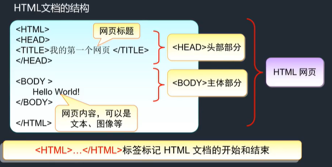
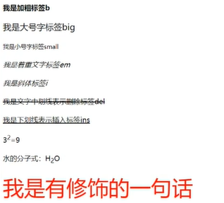
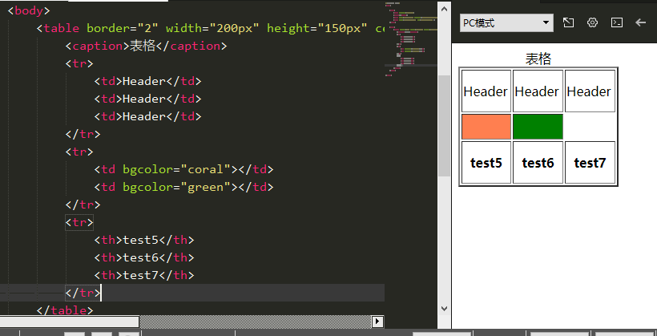
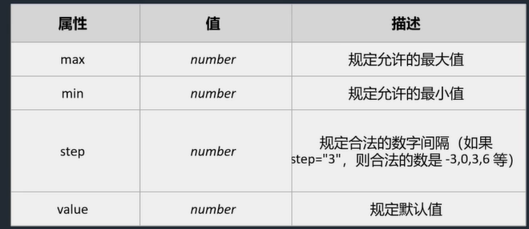
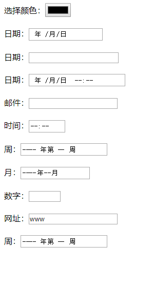

##### 定义

- html：超文本标识语言，是web开发的基本技术，对应的产出物-网页，页面，用html技术所编写的文件，被称为html文件，web文件，页面文件，网页文件。

##### 结构

- 

##### 结构特性

- HTML标记标签通常被称为HTML标签(HTML tag)。
- HTML标签是由**尖括号**包围的关键词，比如<html>
- HTML标签通常是**成对出现**的，如<html>和</html>
- 标签对中的第一个标签是**开始标签**，第二个标签是**结束标签**
- 开始和结束标签也被称为**开放标签**和**闭合标签**

##### 元素

- HTML元素指的是从开始标签到结束标签的所有代码，是HTML语言的基本部分。
- HTML文档由嵌套的HTML元素构成。
- 空的HTML元素：
  - 没有内容的HTML元素被称为空元素。空元素是在开始标签中关闭的。如"\\**\<br>**"(定义换行的标签)就是没有关闭标签的空元素。

##### 常用的基本标签

- 标题:<h1> - <h6>
- 段落:'<p>
- 换行:<br>
- 位置：<align>；<align = "center">
- 链接:<a href= url>；指定跳转到某一界面
- 图像:；引入图片的位置
- 注释: <!--This is a comment-->
- 嵌入元素(声频、视频):<embed src="文件名">；HTML定义了一些文本格式的标签，可以改变字体样式。
  - <b>粗体bold
  - <big>定义大号字。
  - <small>定义小号字。
  - <em>定义着重文字。
  - <i>斜体italic
  - <del>文字当中划线表示删除
  - <ins>文字下划线表示插入
  - <sub>下标
  - <sup>.上标
  - 字体、字号标签<font color=""  size = "px">text area</font>
  - 

- 表格

  - 表格由<table border="定义边框大小" height="xxx px" weight="xxx px"> 标签来定义。
  - 每个表格均有若干行(由<tr> 标签定义) ,
  - 每行被分割为若干单元格(由<td> 标签定义)。
  - 字母td指表格数据(table data) ,即数据单元格的内容。数据单元格可以包含文本、图片、列表、段落、表单、水平线、表格等等。
  - <th></th>：使用th标签包裹起来的列其内容是一个居中和加粗的效果
  - <caption></caption>：给表格起表名字
  - **三个元素必须一起使用，否则无法定义表格。**
  - 

- 表单

  - HTML表单用于搜集不同类型的用户输入。最常见最典型的表单即注册页面。

  - 表单是一个包含表单元素的区域。

  - 表单元素是允许用户在表单中(比如:文本域、下拉列表、 单选框、复选框等等)输入信息的元素。

  - 表单使用表单标签(<form>) 定义。

  - 基本格式：

    - ```html
      < form Action= "url" Method="post/get"><input> </input></form>
      ```

    - 表单的三个要点

      - 表单控件(Form Controls)
      - 动作属性(Action)
      - 方法属性(Method)

    - input根据type可分为：（1）文本输入框：type=“text/passwor”（2）单选按钮： type="radio"（利用设置多个input标签的name属性值保持一样来使得其指向同一input标签）（3）复选框：type="checkbox"（可以使用checked属性来定义默认值）（4）按钮：type="button"

    - select:下拉列表，用option标签定义多个选项，用selected属性来定义默认值。

    - textarea文本域：创建一个文本域框供输入相关意见。可以通过指定其cols和rows属性来指定默认情况下其文本框的大小。

    - 动作属性：当用户单击确认按钮(即提交表单)时，表单的内容会被传送到另一个文件。表单的动作属性定义了目的文件的文件名。由动作属性指向的这个文件通常会对接收到的输入数据进行相关的处理。

    - 方法属性：Method属性告诉浏览器如何将编码后的数据发给服务器。其值为get或者post。get:浏览器会将数据直接附在表单的action URL之后。这两者之间用问号进行分隔。post:直接连接服务器，然后将html表单中的值发送给WEB服务器。这种方式是没有字符长度限制的。

    - ```html
      <body>
      		<form action="www.baidu.com" method="get">
      			
      			用户名：<input type="text" name="wenben" maxlength="10" size="5"/><br><br>
      			密码：<input type="password" name="mima" maxlength="10" size="5" value="" /><br><br>
      			性别：<input type="radio" name="sex" value="1" />男
      			<input type="radio" name="sex" value="2" checked="checked"/>女<br><br>
      			请选择您喜欢的数字：
      			<input type="checkbox" name="c01" value="1"> 11
      			<input type="checkbox" name="c02" value="2" checked="checked"> 12
      			<input type="checkbox" name="c03" value="3"> 13 <br><br>
      			请选择你喜欢的食物：
      			<select name="food">
      				<option value="">面包</option>
      				<option value="">牛奶</option>
      				<option value="" selected="selected">牛肉</option>
      				<option value="">鸡肉</option>
      			</select><br><br>
      			说出您的意见：<br><br>
      			<textarea name="tt" rows="10" cols="39"></textarea>
      			<input type="button" name="btn" id="" value="普通按钮" />
      			<input type="reset" name="btn" id="" value="重置按钮" />
      			<input type="submit" name="btn" id="" value="重置按钮" />
      		</form>
      	</body>
      ```

      

    - 额外的Input类型：

      - color：用于选取颜色

      - date：从一个日期选择器选择一个日期

      - datetime：选择一个日期(UTC 时间)

      - datetime-local：选择一个日期和时间 (无时区).

      - email：包含e-mail地址的输入域

      - month：选择一个月份

      - number：包含数值的输入域

      - 

      - time：选择一一个时间

      - url：包含URL地址的输入域，在提交表单时，会自动验证url域的值。

      - week：选择周和年

      - ```html
        <body>
        		<form action="www.baidu.com" method="get">
        			选择颜色：<input type="color" name="1" id="" value="" /><br><br>
        			日期：<input type="date"/><br><br>
        			日期：<input type="datetime"/><br><br>
        			日期：<input type="datetime-local"/><br><br>
        			邮件：<input type="email" name="mail" /><br><br>
        			时间：<input type="time" name="mail" /><br><br>
        			周：<input type="week"/><br><br>
        			月：<input type="month"/><br><br>
        			数字：<input type="number" max="10" min="0" step="1"/><br><br>
        			网址：<input type="url"/><br><br>
        			周：<input type="week"/><br><br>
        			
        		</form>
        	</body>
        ```

      - 

