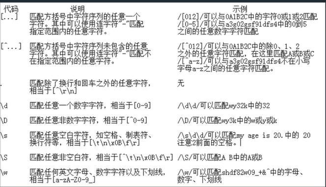
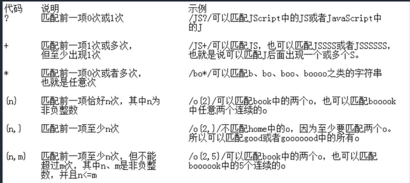
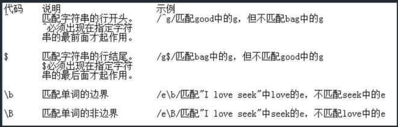
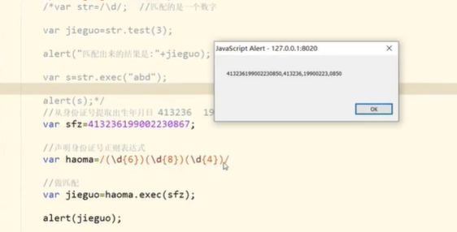

# JavaScript

##### 简介

- JavaScript是一种具有面向对象能力的、解释型的程序设计语言。

- 它是基于对象和事件驱动并具有相对安全性的客户端脚本语言。因为他不需要在一个语言环境下运行，而只需要支持它的浏览器即可。它的主要目的是，验证发往服务器端的数据、增加Web互动、加强用户体验度等。
- 基于对象：提供好了很多对象，可以直接拿过来使用
- 事件驱动： html做网站静态效果，JavaScript实现动态效果
- 客户端：专门指的是浏览器
- JS的作用：操作HTML和CSS

##### 特点

- 松散型:JavaScript语言核心与C、C++、Java 相似，比如条件判断、循环、运算符等 。但，它却是一种松散类型的语言，也就是说，它的变量不必具有一个明确的类型。
- 解释型:不需要编译。浏览器直接解释执行。
- 基于对象:我们可以直接使用JS已经创建的对象。Math String
- 安全性:不允许访问本地硬盘，不能将数据写入到服务器上。
- 跨平台: js依赖于浏览器本身，与操作系统无关。。

##### 如何在网页中写JS

- 在页面中直接嵌入JS

  - ```javascript
    < script language= "javascript" >
    js程序
    </script>
    ```

  - js代码可以插入在<head> </head>标签中间，也可以放在< body> </body>标签中间。

  - 最常用的是放在<head> </head>

- 在外部当中引用JS

  - 如果脚本比较复杂或者是同一段代码被很多页面所使用，则可以将这些脚本代码放置在一个单独的文件中，该文件的扩展名是.js,然后再需要使用该代码的web页面中链接该JavaScript文件即可。

  - ```javascript
    <script language= "javascript" src=”.js后缀的文件路径" > </script>
    ```

  - 一般写在<head> </head>中间比较好

  - 在js后缀的文件中，不需要使用<script> </script>标签对括起来。

  - <body onload= "函数名()" >表示的是加载页面时调用函数，函数是定义在js后缀的文件中。

  - **当一个script标签一旦引用了外部的JS文件，那么在这个标签中如果还存在js代码，是不会执行的。**

##### 语法

- js的变量区分大小写：username userName这是两个不同的变量

- 每行结尾的分号可有可无，如果语句的结束处没有分号，那么js会自动将这行代码的结尾作为语句的结尾。
  alert(" Hello World");
  alert(" Hello World")

- 标识符：所谓标识符，就是指变量、函数、属性的名字，或者函数的参数。标识符可以是下列格式规则组合起来的一或多个字符:

  - 第一字符必须是一个字母、下划线( )或一个美元符号($)。
  - 其他字符可以是字母、下划线、 美元符号或数字。
  - 不能把关键字、保留字、true、 false和nulI作为标识符。例如: myName、book123等

- 可以使用一个var声明多个变量，比如：

- ```javascript
  var now,year,month,date;
  可以在声明变量的同时对它进行赋值，也就是初始化。
  var now= "2015- 10-10",year= "2015",month="10",date="10";
  如果只是声明了变量，没有赋值，那么该变量的默认值是undefined
  JavaScript是弱类型，声明的时候不需要指定变量的类型，变量的类型将根据变
  量的值来确定。
  ```

- 注释

  - 单行注释：//；单行注释使用双斜线"//"开头，在"//"后面的文字即为注释内容，注释的内容在代码执行过程中不起作用。

  - ```javascript
    var now=new Date();//获取日期对象
    ```

  - 多行注释：多行注释以"/*"开头，以"*/"结尾， 在两者之间的内容为注释内容，在代码执行过程中不起任何作用。

  - ```javascript
    /*
    *功能:获取当前日期
    *作者: tony
    */
    function getClock(){
    //内容
    
    }
    ```

- 定义变量时至使用var运算符。

  - ```javascript
    比如: var username= "tom' ;正确
    var age=30;正确
    int age=30;错误
    ```

- 使用大括号标签代码块：{ //代码}被封装在大括号内的语句按照顺序执行。

##### 数据类型

- 数值型
  - 整型
  - 浮点类型
- 字符类型：字符串型数据是使用单引号或者双引号括起来的一个或者多个字符。
- 布尔类型
- 转义字符
- 空值：null；定义空或者不存在的引用
- 为定义的值：已经声明但是没有赋值的变量
- 第四章开始

##### 流程控制

###### if语句

```javascript
1、if(expression){ 
//expression为true的时候执行里面的内容
}

2、if(expression){
//expression为true的时候执行里面的内容
}else{ 
//expression为false的时候执行里面的内容
}

3、if(expression1){
//expression1为true的时候执行里面的内容
}else if(expression2){
//expression2为true的时候执行里面的内容
}else if(expression3){ 
//expression3为true的时候执行里面的内容
}else{
//这个else可有可无。如果有的话，则上述条件
//都不满足的时候执行else

```

###### Switch语句

```javascript
语法格式:
switch(expression){
        
case judgement 1:statement1:break;
case judgement2:statement2:break;
default:defaultstatement;
        
}
```

###### For语句

```javascript
语法格式: 
for(①initialize;②test;④increment)
	
	{③statement

    }
①->②(true)->③->④>②(true)->③- >④-> ... 
①->②(true)->③- >④->②(false) for循环结束

示例: 
var sum=0;
for(var i=1;i<=10;i++){
sum+ =i;
}
alert("总和为:” + sum);

```

###### While语句

```javascript
while循环的循环体可能一次都不执行。

语法格式: while(①expression){ 
	
    ②statement

}
①(true)->②- >①(true)-> 2..... ①(false)直接终止while循环。

示例:
var sum1=0;
var i= 100;
while(i<=1){
sum1+=i;
i+ +;
}
alert("while总和为: "+ sum1);

```

###### Do-While语句

```javascript
while循环的循环体可能一次都不执行。语法格式:
while(①expression){ 

    ②statement

}
①(true)->②- >①(true)-> 2..... ①(false)直接终止while循环。

示例:
var sum1=0;
var i= 100;
while(i<=1){
sum1+=i;
i+ +;
}
alert("while总和为: "+ sum1);
```

###### JS函数定义

```javascript
function functionName([parameter1,parameter2...]){
statments;
[return expression;]
}
```

- function是必须要写的，因为这是定义函数的关键字。
- function Name是函数名，必须要写，而且在同一个页面中，函数名是唯一-的。 并且区分大小写。
- parameter:可选参数，用于指定参数列表。当使用多个参数时，参数间使用逗号进行分隔。一个函数最多可以有255个参数。
- statements:必选参数，这是函数体，用于实现函数功能的语句。
- expression:可选参数，用于返回函数值。expression可以是任意的表达式、 变量或常
  量。

###### 函数调用

```javascript
直接使用函数名
格式: 函数名(实参) ;

//函数调用
var i= account(10,5);

方法二：匿名函数

var变量名= function(参数列表){
	
    函数体
    
return返回值[可有可无] ;
}
```

- 可以将匿名函数作为其他函数的参数使用
- 定义匿名函数可以完成某些一次性的事件[ DOM中的事件]

###### 全局函数

- 全局函数不属于任何一个对象，直接写名称使用即可

  ```javascript
  1.识别字符串中的js代码: eval
  //执行js代码(如果字符串是一个js代码，使用方法直接执行)
  var str = "alert('1234")";
  //alert(tr)://alert('1234)
  //将str直接当做js代码使用
  eval(str);
  document.write(" <hr/> ");
  
  ```

2.对字符进行编码: encodeURI
  var str1 = "测试中文aaa1234";
  var encode1 = encodeURI(str1);
  //%E6%B5%8B%E8%AF%95%E4%B8%AD%E6%96%87aaa1234
  document.write(encode1);
  document.write(" <hr/> "); 

  3.对字符进行解码: decodeURI
  var str2 = "%E6%B5%8B%E8%AF%95%E4%B8%AD%E6%96%87aaa1234";
  var decode1 = decodeURI(str2);
  //测试中文aaa1234
  document.write(decode1);

  4.判断是否为数字: isNaN
  //不是数字返回true,是数字返回false
  var str2 = "123";
  alert(isNaN(str2));
  document.write(" <hr/> ");

  5.类型转换: parselnt
  var str3 = "124";
  document.write(str3 + 1);//字符串拼接，结果为1241
  document.write(" <br/> "); 
  //将字符串转换为整型124，然后加1，结果为125
  document.write(parselnt(str3) + 1);//125

### 事件

  ##### 概述

  - 例如在页面载入完毕时，将触发onload(载入)事件;当用户单击按钮时，将触发按钮的onclick事件等。

  ##### 常用事件

  - onabort：对象载入被中断时触发
  - onblur：元素或窗口本身失去焦点时触发
  - onchange：改变<select>元素中的选项或其他表单元素失去焦点，并且在其获取焦点后内容发生过改变时触发
  - onerror：出现错误时触发
  - onfocus：任何元素或窗口本身获得焦点时触发
  - onkeydown：键盘键(包括Shift、 Alt等) 被按下时触发
  - onkeypress：键盘键被按下，并产生一个字符时触发。也就是说按下Shift或Alt等键不会触发
  - onkeyup：释放键盘上的按键时触发
  - onload：页面完全载入后触发
  - onunload：页面完全卸载后触发
  - onclick：单击鼠标左键时触发。当光标的焦点在按钮上，并按Enter键时也会触发
  - ondblclick：双击鼠标左键时触发
  - onmousedown：单击任何一个鼠标按键时触发
  - onmousemove：鼠标在某个元素上移动时持续触发
  - onmouseout：鼠标从指定的元素上移开时触发
  - onmouseover：鼠标移到某个元素时触发
  - onmouseup：释放任意一个鼠标按键时触发
  - onreset：单击重置按钮时，在<form>.上触发
  - onresize：窗C或框架的大小发生改变时触发
  - onscroll：在任何带滚动条的元素或窗口上滚动时触发
  - onselect：选中文本时触发
  - onsubmit：单击提交按钮时，在<form> 上触发

##### 事件处理

- 事件处理程序是用于响应某个事件而执行的处理程序。事件处理程序可以是任意
  的JavaScript语句，通常使用函数来对事件进行处理。

- 第一种方式，在HTML中绑定:

- ```html
  < script language= "javascript" >
  function save(){
  alert("保存按钮被点击");
  }
  </script>
  <input type= "button" name= "save" value= "保存" onclick= "save()"/>
  ```

- 第二种方式，在JavaScript中绑定:

  ```html
  ①<input type= "button" name= "save" id= "save" value= "保存"/>
  
  <script language= "javascript" >
      ②var bt save=document.getElementByld("save" );
      bt save.onclick = function({
      alert("保存按钮被单击");
      };
  </script>
  ```

- 第二种方法要注意先执行①，才能执行②。

#### 正则表达式

##### 概述

- 正则表达式(regular expression)是一个描述字符模式的对象。 使用正则表达式进行强大的模式匹配和文本检索与替换的函数。
- 一个正则表达式是由普通字符(如a~z)以及特殊字符(称为元字符)组成的模式字符串。
- 该模式字符串描述在查找文字主体时待匹配的一个或多个字符串。正则表达式作为一个模板，将某个字符模式与所搜索的字符串进行匹配。

##### 字符类



##### 量词



##### 指定匹配位置



##### 选择匹配符

- 正则表达式的选择匹配符只有一个"I"， 使用""可以匹配指定的多个选项中的任意一项。
- 例如/World|Dream/可以匹配"One World One Dream"中的World或者Dream

##### 分组

- 分组就是使用小括号将多个单独的字符或字符类组合成子表达式，以便可以像处理一个独立的单元那样，用"|"、”*"或者"?"等来处理他们。比如/J(ava)?Script/可以匹配 JavaScript,也可以匹配JScript 

##### 正则表达式的创建

- 正则表达式字的创建是由两条斜线//中间加入模式匹配字符串组成。
- var objExp=/\d/;

##### 正则表达式的判定

- 使用test()方法进行模式匹配，test()方法用于对一个指定的字符串执行模式匹配，如果搜索到匹配的字符，返回true,否则返回false
- var objExp=/\d/;
  objExp.test(" abc");
- 使用exec()方法进行模式匹配，exec()方法返回值不是true或者false,而是当**没有搜索到匹配的字符时，返回null**；**否则返回一个数组**。这个数组的第一个元素包含与正则表达式相匹配的字符串，其他元素包含的是匹配的各个分组(用括号括起来的子表达式)
- 语法格式：regExp.exec(str)



#### Cookie

##### 概述

- 随着Web越来越复杂，开发者急切的需要能够本地化存储的脚本功能。这个时候，第一个出现的方案: cookie诞生 了。cookie的意图是: 在本地的客户端的磁盘上以很小的文件形式保存数据。
- cookie也叫HTTP Cookie,最初是客户端与服务器端进行会话使用的。比如，会员登录，下次回访网站时无须登录了;或者是购物车，购买的商品没有及时付款，过两天发现购物车里还有之前的商品列表。
- HTTP Cookie要求服务器对任意HTTP请求发送Set-Cookie,因此，Cookie的处理原则上需要在服务器环境下进行。当然，现在大部分浏览器在客户端也能实现Cookie的生成和获取。(目前Chrome不可以在客户端操作，其他浏览器均可)

##### 组成

- cookie由名/值对形式的文本组成:
  - name=value。完整格式为:
  - document.cookie = 'user=值; [expires=失效时间; path=路径访问; domain=域名访问; secure=安全的https限制通信]'中括号是可选，name=value是必选。//向本地磁盘写入cookie
  - document.cookie = 'user= 大狗';alert(document.cookie); 

##### Cookie的局限性

- cookie虽然在持久保存客户端用户数据提供了方便，分担了服务器存储的负担。但是还有很多局限性的。
  - 第一:每个特定的域名下最多生成20个cookie (根据不同的浏览器有所区别)。
    - IE6或更低版本最多20个cookie 
    - IE7和之后的版本最多可以50个cookie. IE7最初也只能20个， 之后因被升级不定后增加了。
    - Firefox最多50个cookie
    - Opera最多30个cookie 
    - Safari和Chrome没有做硬性限制。
  - cookie的最大大约为4096字节(4k),为了更好的兼容性，一般不能超过4095字节即可。
  - cookie存储在客户端的文本文件，所以特别重要和敏感的数据是不建议保存在cookie的。比如银行卡号，用户密码等。

