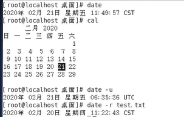

Linux

- Linux具备现代-切功能完整的UNIX系统所具备的全部特征，其中包括真正的多任务、虚拟内存、共享库、需求装载、共享的写时复制程序执行、优秀的内存管理以及TCP/IP网络支持等。
- Linux的基本思想有两点:
  - 第一：一切都是文件
  - 第二：每个软件都有确定的用途。其中第一条详细来讲就是 系统中的所有都归结为一个文件，包括命令、硬件和软件设备、操作系统、进程等
- 多用户、多任务
  - Linux支持多用户，各个用户对于自己的文件设备有自己特殊的权利，保证了各用户之间互不影响。
  - 多任务则是现在电脑最主要的一个特点， Linux可以使多个程序同时并独立地运行。
- 完全免费
  - Linux是一款免费的操作系统，用户可以通过网络或其他途径免费获得，并可以任意修改其源代码。
- 内核版本----主版本号次版本号修订次数
  - 奇数版本---开发版本 eg：2。5。1
  - 偶数版本---稳定版本 eg：2。6。1

## Linux目录结构

- FHS标准( Filesystem Hierarchy Standard ) :
  - /boot：启动目录，内核存放地
  - /etc：配置文件存放地
  - /tmp：程序产生的临时文件
  - /home：用户的目录，新增用户账号时，用户的家目录都存放在此目录
  - /lib：库文件，程序在执行过程中，需要调用一些额外的参数时需要函数库的协助
  - /bin：可执行文件和常用的Linux命令
  - /sbin：系统管理员的命令和工具
  - /usr：应用程序和文件的安装地
  - /mnt：挂接其他文件系统
  - /root：root帐户的home目录
  - /dev：存放linux系统 下的设备文件

## Linux常见命令

1. vi使用:命令模式、末行模式、编辑模式。

- vi
  - 功能：生成新文件或者编辑、查看文件。
  - 格式：vi file _name。eg：vi test
  - 说明：上面的命令 直接进入vi的命令模式。
  - 使用：从命令模式进入编辑模式，需要按i键或者a键：1) i插入文本；2) a追加文本。使用ESC键可以从编辑模式进入命令模式。
- vi命令模式
- 命令模式
  - :W  保存文件;
  - :wq  保存并退出;
  - :wq!   保存并强制退出;
  - :q  退出;
  - :q!  强制退出;
  - dd  删除行文字;（退出编辑模式后才能进行适用）
  - x 删除一个字符;（退出编辑模式后才能进行适用）
  - :n  光标移至文本第n行;（退出编辑模式后才能进行适用）
  - $  光标移至文本的行尾;（退出编辑模式后才能进行适用）
  -  G  光标移至文本的末尾行的首字母（root用户）/光标移至文本的末尾行最后一个字母（root用户）（退出编辑模式后才能进行适用）
  -  /  查找某个字符串在文档中**[第一次]()**出现的位置。/sdb（退出编辑模式后才能进行适用）

2. Linux管理文件和目录的命令

- pwd
  - 功能描述:打印用户当前所处的路径。(print work directory)
  - 在文本模式下，使用命令:[root@localhost ~]#pwd 
- cd
  - 功能描述:改变用户所在目录。(change directory)
  - 格式: cd <目录名>
  - [root@localhost ~]#cd 。。    返回到当前目录的上一级目录
  - [root@localhost ~]#cd       返回当前用户的主目录（如果是root用户登录，则返回root目录）
  - [root@localhost ~]#cd /home    用路径切换到home目录
- Is命令
  - 功能描述:显示指定目录下的内容。( list directory )
  - 格式: Is [参数] [目录或文件] 
  - 选项           含义
  - -a               列举目录中的全部文件，包括隐藏文件
  - -|               列举目录中的细节，包括权限、所有者、组群、大小、创建日期、文件是否是链接等
  - -r               逆向，从后向前地列举目录中内容（先显示目录再显示文件）
  - -R              递归，该选项递归地列举当前目录下所有子目录内的内容
  - -s               文件大小size (以数据块的形式的做表示）
  - Is -| 1。txt   列举文件1。txt的所有信息	
- cat命令
  - 功能描述：显示文本内容
  - 语法：cat文本文件名字
  - 例如:在屏幕上显示整个文件的内容: cat 1。txt 
- touch命令
  - 功能描述：创建文本但不能进行编辑(不能插入内容) 
  - 语法: touch 文本文件名字1，文本文件名字2，。。。。。。
  - 例如: touch 12。txt
- grep命令
  - 功能：是在一堆文件中查找一 个特定的字符串。
  - 语法：grep 查找的字段  查找的文件
  - 注意：以上命令在test。xt中查找money这个字符串，grep查找是区分大小写的。
- cp命令
  - 功能描述:拷贝文件或复制文件。(copy) 
  - 格式: cp [源文件] [目标文件]
  - 选项         含义
  - -i               互动：如果文件将覆盖目标中的文件，他会提示确认
    -r               递归：这个选项会复制整个目录、子目录以及其他
    -v               详细：显示文件的复制进度
  - [root@localhost ~]#ls
  - [root@localhost ~]#cp hello。txt file1。txt 把文件hello拷贝份，命名为file1
- mv命令
  - 功能描述:可以对文件或者目录进行移动。
  - 格式: mv [源对象] [目的对象]
  - 选项     说明
    -i          互动：如果选择的文件会覆盖目标中的文件，他会提示确认
    -f          强制：不提示地移动文件
    -v         详细：显示文件的移动进度
- mkdir
  - 功能描述:创建目录。( make directory )
  - 格式: mkdir [目录名1] [目录名2]
    [root@localhost ~]#mkdir dir2创建一个目录dir2
    [root@localhost ~]#ls借助ls命令 查看dir 2是否创建成功
    [root@localhost ~]#mkdir bb CC dd  一次性创建多个目录
  - mkdir **-p** aa/bb 目录里面只能嵌套一 个目录（实现嵌套目录的方法）
- rmdir
  - 功能描述:删除空目录。( remove directory )
  - 格式: rmdir [参数] [目录名1] [目录名2] 。。。。
  - [root@localhost ~]#rmdir dir2删除一 个空目录
  - [root@localhost ~]#rmdir bb CC dd删除多个空目录
  - 注意事项：1、不能删除非空目录。2、不能删除当前目录
  - -p   删除指定目录，如果这个指定目录被删除后，他所在的父目录为空，也会一并删除
- rm命令
  - 功能描述:删除文件。remove
  - 格式: rm [参数] [文件]
  - 选项          说明
    -i                互动:提示确认删除
    -f                强制:代替互动模式，不提示确认删除
    -v               详细:显示文件的删除进度
    -r                递归:将删除某个目录以及其中所有的文件和子目录

3. 线上查询的命令

- man命令（Ctrl + Z）
  - 功能:用来查询和解释一个命令 的使用方法和这个命令的注意事项。
  - 格式:man命令的名称
  - 要查询ls命令的说明书页，输入命令: man ls 退出按下q
- locate命令
  - 功能:定位文件和目录。
  - 格式:locate文件或者目录名字
  - 想要搜索带有test的这个词的文件，输入命令: locate test
  - ocate命令使用数据库来定位带有test这个词的文件或目录。
- whatis命令
  - 功能:用来查询某个命令的含义。
  - 要查询mv命令的含义，输入命令：whatis mv 

4. 文件备份和压缩命令

- bzip2命令
  - 功能:bzip2来压缩文件（仅压缩文件），压缩后的文件后缀名字为bzip2。
  - 格式:bzip2 filename 
  - 文件即会被压缩，并被保存为filename。bz2。
  - 要解压缩文件，输入命令：bunzip2 filename。bz2
  - filename。bz2会被删除，而以filename代替。
  - bzip2 file1 file2 file3 /home/aa：上面的命令把file1、file2、 file3以及 /home/aa目录中的内容压缩起来。
  
- gzip命令（仅针对文件进行压缩/解压）

  - 要使用gzip来压缩文件， 输入命令：gzip filename
  - 文件即会被压缩，并被保存为filename。gz。
  - 要解压缩文件，输入命令：gunzip filename。gz
  - filename。gz会被删除，而以filename代替。
  - 参数      定义
  - -r :         递归处理，将指定目录下的所有文件及子目录一并处理;
  - gzip -r file1  上面的命令把file1目录中的内容压缩起来。

- tar命令

  - 功能描述:将文件或者目录进行打包、或者解压缩。
  - 格式: tar [参数] [打包后的文件名] [需要打包的文件或目录]。
  - 其中参数包含以下几个:
  - -c：创建压缩文件;
  - -x：展开归档文件;
  - -t：显示包括在tar文件中的文件列表（在不进行解压的情况下查看压缩包里包含什么内容）
  - -z：压缩/解压缩文件 (gz格式) ;（加上对于文件夹的压缩）
  - -v：写入或读取时，显示所有的文件;（在压缩或者解压缩的时候会显示你对哪些文件进行了压缩和解压缩）
  - -f：指名要展开的归档文件名;（给要压缩的文件起名字）
  - -j：压缩或解压缩文件 ( bz2格式)。
  - [root@localhost ~]#tar cvf（压缩参数组合） test。tar /home/test将home 下目录test打包成tar包
  - [root@localhost ~]#tar xvf （解压缩参数组合）test。tar 将test。tar解压缩

  - ps：经压缩后的文件仍旧存在
  - tar cvf file。tar a b c：将a，b，c三个文件夹一起压缩到file。tar
  - 
  - 要创建一个tar文件 ，输入命令：tar -cvf filename。tar aa bb
  - 上面的命令将aa、bb放入文件中。
  - 要列出tar文件的内容，输入命令：tar **-tvf** filename。tar
  - 要抽取tar文件的命令，输入命令：tar -xvf filename。tar
  - 这个命令不会删除tar文件，但会把解除归档的内容复制到当前工作目录下，并保留归档文件所使用的任何目录结构。
  - 对文件进行压缩的操作
    参数1: cjvf         后缀名:xxx。 tbz
    参数2: czvf        后缀名:xxx。 tgz
  - 对文件进行解压缩的操作
    参数1: xjvf
    参数2: xzvf
  - 要创建一个使用tar和bzip2来归档压缩的文件，使用j选项：tar -cjvf filename。**tbz** file
  - 要扩展并解除归档bzip tar文件，输入命令：tar -xjvf filename。tbz
  - 要创建一个用tar和gzip归档并压缩的文件，使用-z选项：tar czvf filename。**tgz** file
  - 要扩展并解除归档gzip tar文件，输入命令：tar -xzvf filename。tgz

5. 文件阅读命令

- head命令
  - 功能描述：head命令可以用来查看文件的开头部分。
  - 此命令的格式是：head 文件名
  - 默认设置，它只查看文件的**前10行**。但可以通过指定一个数字
  - 选项来改变要显示的行数，命令如下：head   -20  文件名；这个命令将会查看文件的前20行。
- tail命令
  - 功能：查看文件结尾的10行（默认）。
  - 格式：tail -行数 文件名
  - 这有助于查看日志文件的最后10行来阅读重要的系统信息。
- more命令
  - 功能：按页来查看文件的内容more使用空格键和b键来前后移动。
  - 语法：more [选项] [fileNames]
  - eg：more 1。txt
  - 选项            含义
    -num           一次显示的行数
    -f                  计算行数时，以实际上的行数，而非自动换行过后的行数(有些单行字数太长的会被扩展为两行或两行以上)
    +num           从第num行开始显示
  - 要使用more在文本文件中搜索关键字，按/键并输入命令搜索条目：从文件中查找第一个出现"Iq"字符串的行 ，并从该处前两行开始显示输出
  - more +/lq 1。txt
  - ps：1、找到的话内容是从前两行开始输出。2、找到了的话关键词以下的内容也是按照分页的方式进行输出。
  - 使用空格键来先前翻阅页码。按q键退出。
  - 当一个目录下的文件内容太多，可以用more来分页显示。这得和管道| 结合起来：Is -al /etc| more -5，"I” 表示管道，作用是可以将前面命令的输出当做后面命令的输入。

6. 定位、查找文件的命令

- which

  - 语法：which命令
  - 说明：依序从path环境变量所列的目录中找出命令的位置，并显示完整路径的名称。在找到**第一个符合条件**的程序文件时，就**立刻停止搜索**，省略其余末搜索目录。
  - 范例，找出Is命令的程序文件的位置：which Is；系统输出：/usr/bin/ls 

- whereis（会找出所有符合条件的 ）

  - 功能描述：whereis指令查找符合条件的文件，whereis命令只能定位一些文件在文件系统中的位置。whereis命令- 般用于 程序名的搜索。

  - 语法：whereis [-bm] 程序名

  - 参数说明:
    -b：**只找二进制文件**
    -m：显示man说明文件查出说明文档路径

    

7. 管理使用者和设立权限的命令

- chmod命令
  - 功能描述：chmod命令用来改变许可权限。读取、写入和执行是许可权限中的三个主要设置。
  - 其中r-文件可以被读取，w-文件可以被写入，x-文件可以被执行。
  - 如果文件是程序的话则可以使用带有-l的Is命令来仔细查看一个文件的许多细节。
  
- 补充权限相关内容：以-rw-r--r--为例进行说明

  - 权限的划分是分为四组(从左向右)
    第一组:第- -位代表的是文件类型- 代表的文件(文本文档) d 代表的是目录
    第二组:占三位rw- 代表的是用户主人的权限(文件拥有者)  u
    第三组:占三位r--  代表和用户主人同组成员的权限 g
    第四组:占三位r-- 代表其他人的权限 o

- chmod命令用来设定文件的权限。标准用法：chmod文件的使用者(u，g，o)增减(+，-， = )权限名称(r，w，x)文件 
  u   拥有文件的用户
  g   所有者所在的组群
  o   其他人
  a   代表所有
  删除某一文件的所有权限，输入命令：chmod a-rwx test。txt
  为文件所有者添加权限，输入命令：chmod u+rwx test

  

- useradd与userdel

  - 功能描述:添加用户、删除用户（但是经历删除后用户相关的配置文件数据依旧还是存在的，比如/home下的文件夹）。
  - 格式: useradd [用户名]   /   userdel [参数] [用户名]
  - [root@localhost ~]#userdel wang           删除用户wang ，但不能删除目录/home/wang
    [root@localhost ~]#userdel **-r** zhang      删除用户zhang ，并且删除目录/home/zhang（彻底删除用户配置信息）
  
- chgrp命令
  
  - 作用：用于变更文件或目录的所属群组。
  - 
  
- chown命令
  
  - 作用:将文件的拥有者改为指定的用户或组。
  - 这个指令只有是由系统管理者(root)所使用， 一般使用者没有权限可以改变别人的文件拥有者， 也没有权限可以把自己的文件拥有者改设为别人。只有系统管理者(root)才有这样的权限。

- su命令

  - 功能:用来修改用户。
  - 语法:su 用户名
  - 假设当前用户root ，想要转变为user02，则输入命令:su -| user02
  - su 用户名：代表切换用户，但是所进行切换的用户，所用的系统环境变量还是上一用户的。
  - su -l 用户名：不仅把用户进行切进来，还把用户自己的环境变量也加载进来

- passwd 命令

  - 功能说明：改用户密码
  - 语法：passwd 用户名

  

8. 有关关机和查看系统信息的命令

- 退出终端命令：exit

  - 文本模式下使用快捷键Ctrl+D

- 重新启动

  - 在文本模式下使用命令：[root@localhost ~ ]#reboot
  - 也可以使用命令：[root@localhost ~]#shutdown -r <time>
  - 例如：shutdown -r now  现在立刻重启
  - shutdown -r 11:30  等到11:30进行重启

- 关机

  - 在文本模式下，使用命令：[root@localhost ~ ]#halt
  - 也可以使用命令：[root@localhost ~ ]#shutdown -h <time >
  - 例如: shutdown -h now  现在立刻关闭系统
  - shutdown -h 11:30  等到11:30关闭系统
  - shutdown -t 2  在2min内关机

- ps命令（静态的查看进程的方式，不会随时间进行刷新展示）

  - 功能描述：查看在计算机系统中，有哪些**程序正在执行**及其**执行**的情况。用它来找出所有的**process id**和名称。也可以用来**列出所有程序占用内存**的情况

  - 选项       功能
    u            列出使用者的名称和使用时间
    x             列出所有程序

  - 例如: ps u 查看有关使用者的信息

    

    ​        ps x  列出所有程序分布情况(查询出所有的进程号pid)

    

- top命令（动态的查看进程的方式，会随时间进行刷新展示）

  - 功能：可以查看目前程序的执行情景和内存使用。它和ps类似，不过，它会**几秒钟更新一次系统状态**，方便追踪。要离开这个程序，按CtrI+C键就可以了或者q。
  - 也可以查看系统的运行时间

- kill命令

  - 功能：用来终止一个正在执行中的进程。如果一个程序执行过程中失败了，可以把这个程序终止，避免留在内存中占用系统资源。
  - 语法：kill  进程号

- date :用来设定和修改现在的时间和日期

  - 例如: date -u使用格林尼治时间
              date -r 1.txt    最后-次修改文件的时间
              date -s 18:00   设置时间

    

- cal  日历

  - 若要显示整年的年历,可以在cal命令后加4位数的年份。
  - 例如要显示2017年的年历,必须输入：cal 2017
  - 某一月份: cal 10 2017

9. 磁盘空间指令

- df命令
  - 功能：检查硬盘的使用量
  - 说明：-a  可以列出全部文件系统和各分区的磁盘使用情况

- du命令
  - 功能：显示文件目录的大小
  - 语法：du参数文件名字
  - 说明：-ab 列出所有文件和目录所占的空间

10. 网络操作命令

- ifconfig：显示网络设备的状态
- ping：用于检测主机。
  - 执行ping指令会使用ICMP传输协议，发出要求回应的信息，若远端主机的网络功能没有问题，就会回应该信息,因而得知主机运作正常。
- netstat：知道整个Linux系统的网络情况或显示网络状态。
  - 显示详细的网络状况：netstat -a
  - 显示UDP端口号的使用情况：netstat -apu（win：-n/-u）

11. 其他相关指令

- clear

  - 功能描述:清屏(清除当前命令窗口内容)。( clear )
  - 格式: clear
  - [root@localhost ~ ]#clear   清屏。

- echo

  - 功能描述:在显示屏上回显文字或者用来查看环境变量的值。
  - 格式: echo [需要显示的内容]
  - [root@localhost ~]#echo "hello, boy"    显示hello, boy 
  - [root@localhost ~]#echo $PATH    查看PATH的取值，是否有/sbin目录

- uptime

  - 功能:系统运行时间（从开机到运行至当前的时间）

- wc

  - 功能:用于计算字数。

  - 语法:wc  参数  文件名

  - 在默认的情况下，wc将计算指定文件的行数、字数（一行连续的字符称之为一个字）以及字节数

    

    

  - 参数:
    -c    只显示Bytes数。
    -l     只显示行数。
    -w   只显示字数。

