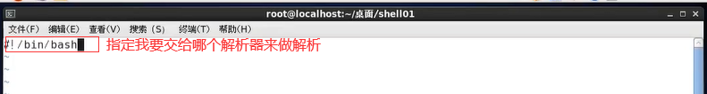
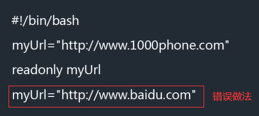
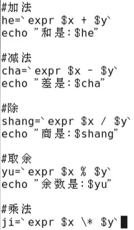
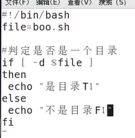
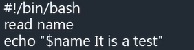
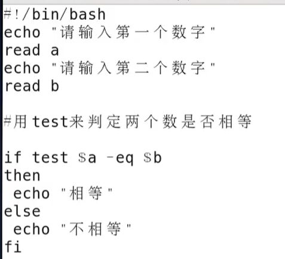
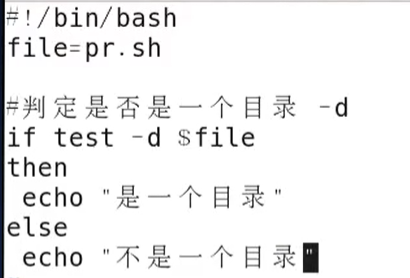

## Shell

##### 概述

- Shell 是一个用C语言编写的程序它是用户使用Linux的桥梁。
2. Shell 既是种命令语言,又是一种程序设计语言。
- Shell 是指一种应用程序，这个应用程序提供了一个界面,用户通过这个界面访问操作系统内核的服务 

##### Shell环境

- Shell编程只要有一个能编写代码的文本编辑器vi和一个能解释执行的脚本解释器就可以了。
- 也即/bin/bash。 

##### Shell的版本类型

- Bourne Shell ( /usr/bin/sh或/bin/sh ) 
- **Bourne Again Shell ( /bin/bash )**（主流使用）
- C Shell ( /usr/bin/csh )
- K Shell ( /usr/bin/ksh )
- Shell for Root ( /sbin/sh )

##### shell脚本

- 将多个Linux市令写在一个脚本文件中，用户只需要执行这个脚本文件一次，就会把脚本中所包含的所
  有命令全部执行

##### shell构成

- bash环境文件
  - .bash_ profile
    - 设置环境变量
    - **帐户一建立，该文件就存在（随着用户的产生而产生）**
  - .bashrc
    - 存放针对bash的命令
    - 每次启动就执行它
    - 在.bash_ profile之后执行
  - .bash_ logout 
    - 仅在退出注册时运行
  - .bash history
    - 历史纪录

##### shell脚本格式

- 格式：vi shell_script.sh
- 脚本第一行格式：#!/bin/bash
- 符号#!用来指定该脚本文件的解析程序，这里使用的是bin目录下的bash解析器。当编辑好脚本后，如果要执行该脚本,还必须使其具有可执行属性。

- 变量调用：$para_name
- 只读变量：使用readonly命令可以将变量定义为只读变量,只读变量的值不能被改变。
- 删除变量：使用unset命令可以删除变量，变量被删除后不能再次进行使用，且unset命令不能删除只读变量。语法为：unset variable_name
- 求解字符串的长度：$(#para_name)能够获取一个字符串的长度
- 截取字符串：用“:”来进行提取即可，语法为”para_name:start_index:length of cut out“
- 解析方式一：chmod +x脚本文件的名字   eg：./脚本文件的名字
- 解析方式二：/bin/bash  脚本文件的名字

 

##### shell数组

- 定义格式：array_name = (value0 value1 ... valuen)
- 引用数据：${array_name[index]}
- 使用@符号可以获取数组中的所有元素，例如：echo ${array_ name[@]}
- 获取数组的长度：
  - 取得数组元素的个数：length= ${#array_ name[@]}
  - 取得数组单个元素的长度：lengthn=${#array_name[n]} 

##### shell基本运算符

- 算数运算符：expr的使用：`"``expr``
  - expr计算表达式工具要使用反引号给包患起来在esc键下方；使用格式:‘ expr数值1运算符号数值2’。例: var=' expr 1 + 1'
  - 
  
- 关系运算符
  - -eq       检测两个数是否相等,相等返回true。      [$a -eq $b]返回false。
  - -ne       检测两个数是否相等,不相等返回true。  [$a -ne $b]返回true.
  - -gt       检测左边的数是否大于右边的,如果是,则返回true。    [$a -gt $b]返回false.
  - -lt       检测左边的数是否小于右边的,如果是,则返回true。     [$a -It $b]返回true.
  - -ge       检测左边的数是否大于等于右边的,如果是，则返回true。    [$a -ge $b]返回false。
  - -le       检测左边的数是否小于等于右边的,如果是,则返回true。        [$a -le $b]返回true。
  
- 布尔运算符

  - !   非运算对表达式结果进行取反的操作[ ! false ]=true
  - -o 或运算连接两个表达式，只要有一一个表达式结果为true。整体结果就为true
  - -a 与运算连接两个表达式,只要有一-个表达式结果为false ,整体结果就是false

- 逻辑运算符

  - 格式：[[ 判定条件1 8& 判定条件2 ]]，如[[$a -lt 100 && $b -gt 100 ]]
  - &&   逻辑与只要有false ,整体结果就是False
  - II       逻辑或只要有true，整体结果就是true

- 字符串运算符

  - =             判定两个字符串是否相等，相等返回true
  - !=            判定两个字符事是否相等。不相等返回true
  - -z            判定字符事长度是否为0，为0返回true
  - -n            判定字符事长度是否为0 ，不为0返回true
  - $变量名  判断是否为空，不为空返回true

- 文件测试运算符

  - -d file_name    检测文件是否是目录,如果是，则返回true。[ -d $file ]返回false。

  - -f file_name     检测文件是否是普通文件,如果是，则返回true。[ -f $file ]返回true。

  - -r file_name     检测文件是否可读,如果是，则返回true。 [ -r $file ]返回 true。

  - -w file_name    检测文件是否可写。如果是，则返回true。[-w $file ]返回true。

  - -x file_name     检测文件是否可执行，如果是，则返回true。[ -x $file ]返回true。

  - -s file_name     检测文件是否为空(文件大小是否大于0) 。不为空返回true。[ -s $file ]返回true。

  - -e file_name     检测文件(包括目录)是否存在。如果是，则返回true。[ -e $file ]返回true。

    

- 条件判断：
  
  - if 格式：if [ 判断条件 ]  then 语句块 fi（结束）

##### Echo指令

- 显示变量：
  - 语法：read 变量名   从终端标准输入中读取一行，并把输入行的每个字段的值指定给shell变量 （类似于input语句）
  -  eg：
- 显示结果定向到文件：echo "It is a test " **>（>>：追加模式进行添加）** file_name；如果file_name已存在且非为空，则会覆盖原有内容
- 显示命令执行结果：使用反引号“**`**”，此时会把命令的结果当成一个普通字符串进行输出。 eg：echo  cal,
- -e：开启转义字符

##### Test指令

- 功能：能够与运算符做结合，进行判定工作；把判断条件中的中括号改成了test
- 
- Shell还提供了与(-a)、或(-0)、非(! )三个操作符用于将测试条件连接起来，其优先级为:“!"最高，“-a"次之，'-o"最低。

##### Case语句

- 格式为:
      case      $变量名in
               "第一个变量内容")
               程序段

  ​             ;;

  ​             "第二个变量内容")
  ​              程序段
  ​            ;;

  ​          不包含第一个变量内容 与第二个变量内容的其它程序执行段

  ​           *)

  esac

- 注意：

  - case语句最后必须以esac为结尾.
  - 每个变量内容的程序段最后都需要两个 分号来表示该程序段的结束.
  - 最后的"*“作用表示默认的意思.

##### 命令（杂）

- let命令：它用于执行一个或多个表达式,变量计算中不需要加上$来表示变量

##### 函数参数

- 在Shell中，调用函数时可以向其传递参数。在函数体内部,通过$n的形式来获取参数的值，例如, $1表示第一个参数，$2表示第二个参数...。
- 但是,当n>=10时,需要使用${n}来获取参数。
  - fun(){
    echo "第一个参数为 $1 !"
    echo "第二个参数为 $2 !"
    echo "第十个参数为${1O} !"
    echo "第十一个参数为${11} !"
    echo "**参数总数有$#**个!"
    echo "**作为一个字符串输出所有参数$*** !"
    fun1234567896798