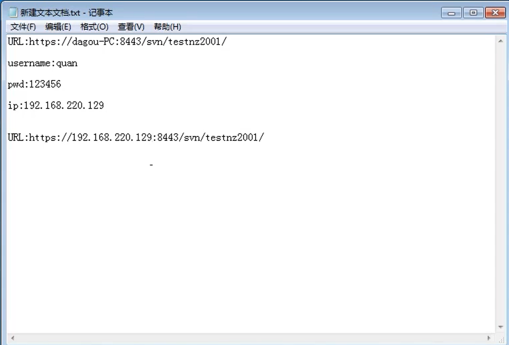

# SVN操作过程

#### 今日内容:

SVN:用于多个人共同使用- -个项目,达到资源共用的目的
SVN的核心是配置库,存储的是所有的数据-文件和目录,在权限许可的情况下,任意数量的客户端
可以访问配置库的内容,就可以进行读写的操作。

#### SVN服务器:

1. 建立仓库( FSFS ,仓库的名字,仓库的结构-空,设置权限-自定义权限-关联用户)
2. 复制一下仓库的ur地址路径选中仓库,右键copy url
3. 要把url地址路径和用户密码发给客户端的员工

#### SVN客户端:

1. 复制领导发来的url地址路径
2. 在本地创建一个新的文件夹 (推荐) , 进入文件夹中,右键,选择-Svn checkout
3. 输入用户名和密码
4. 就可以把库中的文件夹先导出在本地
5. 进入导出的文件夹中,然后把各种要提交的文档或者目录放入其中,右键,选择svn commit进行提
   交
6. 如果没有保存用户名和密码,先登录
7. 去服务器端刷新看是否提交

#### 针对跨平台的访问

主机1 : SVN服务器

主机2 : SVN客户端

#### 具体过程：主机2--->主机1

访问过程:主机1的URL,用户名,密码,主机1的ip地址--->主机2

完整过程:

1. 主机1提供服务端仓库的UR地址,和仓库所关联的用户名以及密码
2. 主机1提供它的ip地址
3. ip地址的查看: ipconfig -->在搜索”中,输入“cmd" ,打开DOS系统
4. 主机2接收到主机1发过来的URL,用户名,密码, ip地址
5. URL和IP地址做结合,格式: ip:8443例: http://192 168.220. 129:8443//svn//testnz2001
6. 在主机2中进行导出和导入的操作

跨平台访问URL地址拼接方法